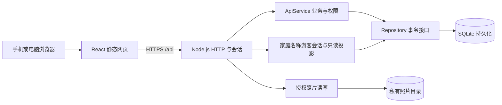

# 人间星图：网页前后端设计

当前主入口为家庭专用的响应式网页。原小程序保留为历史实现与回归测试，见 [小程序架构历史](miniprogram-architecture-history.md)。

## 运行结构

前端、API 为独立进程，前端构建为静态文件。默认由统一域名反向代理 API，避免跨站 Cookie。Compose 分别构建两个镜像，前端 Caddy 负责 HTTPS／静态文件／转发，API 只在内部网络暴露。

## 前端边界

`frontend/` 使用 React、TypeScript、Vite。界面直接请求后端，不再通过微信云函数或本地缓存模拟业务数据。网页只保存当前界面状态；刷新后重新读取后端。登录 Cookie 为 HttpOnly，JavaScript 不保存会话令牌。

路由共享账号上下文位于独立的 `app-context.ts`，避免 `App → Manage → App` 循环依赖在开发热更新后产生不一致的上下文实例。手机输入控件使用至少 16px 文字；手机号支持国内号码及带国家码的海外号码，与添加家人的校验一致。

浏览页面与管理页面分开：管理员也不能在浏览人物时直接改他人资料，自己的备注除外。管理从“我的”进入。家人录使用“亲缘图／家人簿／天南海北”，切换视图时关闭人物详情。当前网页不提供同窗创建、管理或加入流程。

关系图复用纯函数分层算法和亲属称谓引擎，保留本人高亮。城市目录逐级选择，地图以城市中心为标记，默认中国；世界范围与城市成员目录保留完整人数。照片先在浏览器缩小并转 JPEG，后端仍独立验证和清理元数据。

地图使用 Leaflet 渲染随前端部署的 Natural Earth 世界轮廓、中国省界和本地城市地名，默认不请求第三方瓦片服务。地名随缩放逐级显示、相互避让，并为家人城市标记留出空间。城市按屏幕距离聚合，点击可展开成员；可选在线瓦片只在显式配置时启用，失败后保留本地底图。来源与数据重建见 [网页底图说明](web-basemap-data.md)。

## HTTP 与账户

`server/` 使用 Node.js 内建 HTTP、crypto、SQLite。会话使用随机不透明 Cookie，数据库只保存会话哈希。手机号是登录账号标识，密码使用随机盐的异步 scrypt。注册号码暂未短信验证，不写入已验证号码表。

所有写请求必须是 JSON 且 Origin 在精确白名单中。HTTP 层只从可信账号会话获得账号 ID，再调用业务服务；前端传入的角色或账号 ID 不作为授权依据。账号接口仍要求已加入对应家庭；游客通过独立的只读接口浏览，不冒充成员或管理员。

Web 服务使用家庭专用的数据访问范围，家庭名单、生日、申请、邀请、照片等统一限定在家庭记录内；旧同窗的直接地址和邀请码同样不可访问。底层兼容存储和旧客户端业务仍保留历史类型，避免重写或删除已有数据。

网站为家庭专用部署：公开 `circle.create` 不可调用；首个管理员与家庭通过本地 `server/setup.cjs` 初始化。注册必须持有有效家庭邀请；创建账号与占用该邀请在同一 SQLite 事务中完成，避免同一链接反复创建账号。注册后可完善自己的资料并提交申请，管理员审批才授予家庭成员身份。已有成员账号正常登录，不因收紧策略删除数据或退出家庭。

管理员新增家人时必填手机号，Web API 独立归一化并检查家庭内重复。受邀账号的匹配来源是认证表中的登录号码，不是可修改的个人联系方式或请求参数；查找限定在邀请所指家庭。唯一匹配时，本人先确认带入已有资料，管理员审批必须沿用该人物 ID，亲属关系不变。多重匹配、他人已绑定、旧资料验证门禁或资料版本变化均不能静默新建或接管。

`server/web-onboarding.cjs` 在统一 SQLite 事务中处理资料预览、确认导入及审批复核。`invite_profile_imports` 记录邀请、账号、人物版本与自动预填字段版本：只补充缺失资料，保留本人已编辑及显式清空的字段；再次确认时可同步本人未修改的旧预填值。照片在审批成功后才继承，不提前授予原照片访问权。已获家庭成员资格但尚未绑定人物的历史账号，补全资料时优先使用唯一同手机号记录，避免补出第二个人物；姓名相同不是匹配依据。

登录资格由数据库实时判定：现存家庭的有效成员，或拥有有效家庭邀请并处于待完善／待审核流程的账号，才签发账号会话。历史无邀请账号、仅旧同窗资格、过期或撤销邀请、被拒绝申请不能据此登录。旧账号打开新邀请后仍需通过原密码校验，再原子绑定邀请，避免重复注册与冒用。现有会话和每次业务事务继续核对资格；前端收到失效立即清理身份，不显示空的已登录首页。受邀账号显示加入进度，审批后的刷新重新同步账号资格。

查询使用 SQLite 账号、成员和邀请索引，无额外位图或长期权限缓存；角色变更和移出后的请求直接读取当前可信状态。登录密码校验继续使用 scrypt，不因资格检查跳过密码验证。

游客输入家庭名称后获得仅对应家庭的浏览状态，浏览不生成账号或家庭成员。按用户明确要求，家人照片、生日、手机号、微信、城市、近况等资料向知道家庭名称的游客开放；名称可被猜中，不应作为保密凭证。游客投影不包含账号 ID、管理员身份内部字段、申请、审计、设备和其他人的私人备注。游客图不标记“我”，不产生账号视角的私人备注或编辑功能；写入始终走账号认证与原有成员角色检查。

游客家庭快照包含未来 30 天生日，复用后端公农历换算，使用当前家庭有效资料并按最近日期排序。游客没有“本人”，因此不排除任何家人。快照附带服务器时间及下个北京时间午夜；页面到期或恢复浏览时刷新，换算或刷新失败单独提示。生日入口是一次明确的查看人物动作，关闭或切换视图后不会被资料刷新再次打开。

会话默认固定 7 天，选择记住登录后固定 90 天；每台浏览器独立会话，活动不无限延长到期时间。设备管理只返回随机公开 ID、浏览器摘要与时间，不返回会话令牌或其哈希。设备撤销、密码更改及重要操作的近期密码确认由后端校验，业务事务执行时再次确认会话仍然有效。

API 与配置契约见 [server/README.md](../server/README.md)。

## 业务复用与持久化

`backend/src/service.ts`、`packages/kinship/`、`packages/lunar-calendar/` 继续负责原业务规则，包含亲友关系冲突、一次性邀请、审核资料版本、录内管理员更正、私人备注、公农历生日和离开后的访问撤销。

`server/store.cjs` 实现 Repository：使用 SQLite 的事务与持久化文档记录；认证读写和业务事务共用同一个串行队列，避免异步事务期间认证写入被其他请求回滚。账号、会话、限速记录及业务资料都位于持久化目录。

当前支持单 API 实例。未来采用 PostgreSQL 等数据库时替换 Repository 与认证存储，实现等价事务；不能简单把 SQLite 文件复制给多个实例写入。

## 照片

照片保存在非公开目录。上传上限、JPEG 格式、尺寸与元数据清理在后端校验。浏览器拿到的图片 URL 指向需要 Cookie 的 API，而不是可永久公开访问的文件地址。账号照片接口每次重新核对成员与资料权限；游客照片接口重新核对游客会话及所属家庭。移出成员会失去账号接口的访问资格，但仍可按本产品的游客规则重新输入家庭名称浏览；游客不能继续读取移出成员随后更新的全局个人资料。

## 测试与交付

保留亲属、关系布局、旧业务后端与小程序历史回归测试；新增真实 HTTP／Cookie／SQLite 集成测试，覆盖持久化、会话、邀请和图片权限。前端进行 TypeScript 检查、生产构建和浏览器主要流程验收。

本地测试通过不代表已进行公网部署、真实短信服务接入或所有浏览器兼容性验收。部署、数据备份与配置见 [部署说明](web-deployment.md)，具体已验证范围见 [验收记录](web-migration-test-report.md)。
