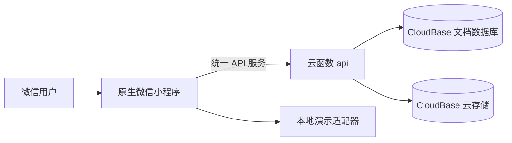

# 亲友关系网小程序：总体设计

状态：第一版本地实现，依据[需求文档](../亲友关系网小程序需求文档.md)。已用测试 AppID 导入微信开发者工具；CloudBase 环境 ID 尚未提供，因此当前使用本地演示数据与可自动测试的业务逻辑。

## 系统边界

- **前端**：TypeScript、WXML、WXSS。页面从统一服务接口读写数据；本地演示与云函数实现共用业务动作和数据形状。详见 `frontend-design.md`。
- **后端**：云函数从微信运行上下文取得用户身份，按 `圈子 → 成员 → 角色 → 字段可见范围` 顺序校验，再访问数据。前端传来的用户 ID 或角色不作为授权依据。详见 `backend-design.md`。
- **亲属称谓与关系图**：独立的纯函数模块从本人卡计算到其他人物的路径、称谓和缺失条件；关系图依据有方向的亲子边和同辈的兄弟姐妹／配偶边分层，高亮本人，点击人物查看称呼与路径。缺信息时显示路径与待确认状态。详见 `kinship-design.md`。
- **地图**：微信原生 `<map>` 展示中国／世界底图，在可见人物的国家和城市上聚合标记；列表与地图读取相同的权限过滤结果。常见城市使用预设中心，其他城市由本人在原生地图上手动选城市中心。`latitude/longitude` 取整到 0.1 度，仅与 `city` 一起按城市可见范围返回。

## 关键数据

圈子包含类型、名称、创建者与班级元信息；成员记录用户在该圈的角色；人物卡记录已认领或未认领的人物及可选的城市代表点；关系记录人物间的亲子、配偶、兄弟姐妹连接；邀请记录创建者、有效期、状态与最多一次成功加入；加入申请供管理员核对；授权记录长辈允许代维护的字段；操作日志保留关键变更。所有圈内记录带 `circleId`，读取时必须先验证当前用户属于该圈。家庭圈和同学圈不共享人物卡或关系。

## 主要流程

1. 建圈者创建家庭圈或一个具体班级的同学圈，自动成为圈主。
2. 圈主或管理员生成短期一次性邀请。被邀请人只能看到申请加入所需的圈子信息，提交申请后仍不能读取圈内资料。
3. 管理员核对并批准一位申请人。批准与消耗邀请必须在同一原子操作中完成。退出或移除后立即失去访问权。
4. 已加入成员只编辑自己的资料和可见范围；未经本人授权，管理员也不能扩大已认领人物的私人资料可见范围。
5. 前端分别展示当前圈允许看到的人物、按辈分分层的关系图、真实城市地图和列表。称呼从本人卡到所选人物计算；选点保存城市级代表坐标，隐藏城市时也隐藏坐标。

## 发布边界

本地演示用于验证交互，不证明真实微信授权、真机地图、云数据库安全规则或微信审核已经通过。已有测试 AppID 用于模拟器；获得 CloudBase 环境 ID 后，先关联环境、部署云函数、配置集合权限，再用两个以上真实微信账号做权限和邀请验收。`miniprogram-ci` 上传的是开发版本，正式上线仍需提审和发布。
