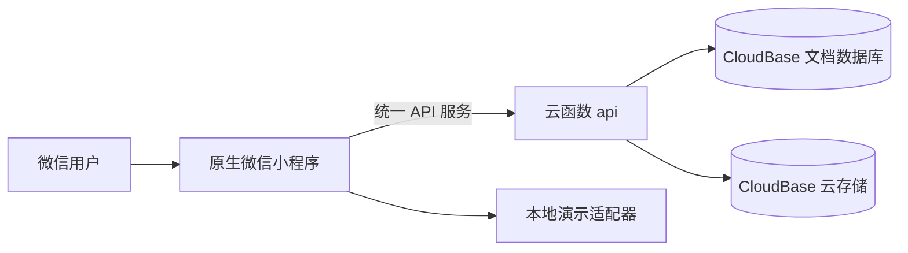

# 亲友关系网小程序：总体设计

状态：第一版本地实现，依据[需求文档](../亲友关系网小程序需求文档.md)。已用测试 AppID 导入微信开发者工具；CloudBase 环境 ID 尚未提供，因此当前使用本地演示数据与可自动测试的业务逻辑。

## 系统边界

- **前端**：TypeScript、WXML、WXSS。页面从统一服务接口读写数据；本地演示与云函数实现共用业务动作和数据形状。详见 `frontend-design.md`。
- **后端**：云函数从微信运行上下文取得用户身份，先校验圈子与有效成员资格，再按角色和人物卡归属校验写操作。已加入同一圈的成员读取相同的人物资料与照片，不设置逐字段或逐照片可见范围；前端传来的用户 ID 或角色不作为授权依据。详见 `backend-design.md`。
- **亲属称谓与关系图**：独立的纯函数模块从本人卡计算到其他人物的路径、称谓和缺失条件；关系图依据有方向的亲子边和同辈的兄弟姐妹／配偶边分层，高亮本人，点击人物查看称呼与路径。缺信息时显示路径与待确认状态。详见 `kinship-design.md`。
- **城市与地图**：人物卡按「国家／地区 → 省／州 → 城市」从离线目录逐级选择，已收录城市自动带入约 0.1 度精度的城市中心；无需在地图上拖动选点。未收录城市可手填，但没有可用坐标时会留在列表并标为“城市待定位”。世界视图先显示基于真实地理数据的全球分布概览，点城市后进入微信原生 `<map>` 城市详细地图；中国视图显示原生地图。列表和地图从同一份人物资料及同一搜索／筛选结果计算，页面同时说明上图人数和未上图原因。地图只表示城市，不读取实时定位或住址。

## 关键数据

圈子包含类型、名称、创建者与班级元信息；成员记录账号在该记录中的角色和访问资格；人物卡记录姓名、阳历／农历生日以及可选的城市代表点，不以是否登录决定其是否出现在列表和关系图中；关系记录人物间的亲子、配偶、兄弟姐妹连接；邀请记录创建者、有效期、状态与最多一次成功加入；加入申请引用服务端保存的唯一账号资料，并保存身份说明和审核版本；操作日志保留关键变更。所有圈内记录带 `circleId`，读取时必须先验证当前用户属于该圈。家人录和同窗录不共享人物卡或关系。首页人数按人物卡统计，与详情列表一致；访问账号数仅供管理逻辑使用。

## 主要流程

1. 创建者建立一份家人录或一个具体班级的同窗录，自动成为管理员。
2. 管理员添加家人或同学时填写姓名、国家／地区、城市与生日（阳历或农历），可选填联系方式、行业等。家人录已有人的情况下，新增家人必须选择一位已记录的人物，填写两人的亲子方向、配偶或兄弟姐妹关系与可选长幼；对方无需注册。仅首个人物可以没有关系。人物和初始关系在同一事务中保存，关系有冲突则均不保存。
3. 创建者或管理员生成 72 小时有效、最多成功加入一次的邀请。受邀者先通过微信手机号登录，并在唯一的「我的资料」中补齐姓名、城市和生日；邀请页仅补充身份说明。同窗录必须核对同班身份。审批前不能读取记录内人物、照片或联系方式。
4. 管理员核对申请人的当前资料，明确选择新建人物资料或连接到已有的对应资料；批准、关联和消耗邀请在同一原子操作中完成。手机号与预录的核对号码匹配只协助已获准加入的人找到已有资料，不能凭号码直接加入。退出或移除后立即失去访问权，并清理本录人物的地点、生日、联系方式、照片和管理员覆盖层。
5. 成员在「我的资料」维护自己的一份账号资料；管理员可在管理页直接修改本记录内人物的资料和关系。管理员改已关联人物的资料只作用于当前记录，不能写入对方账号资料或其他记录；本人更新账号资料时，具体字段与本记录的修正按服务端合并规则展示。记录内成员看到相同的已填写资料和照片。首页提供未来 30 天生日预览，日程页展示未来一年生日；农历生日换算为下一次对应的公历日期。
6. 前端展示已记录的人物、按辈分分层的关系图、地图和列表。称呼从本人节点到所选人物计算；列表和地图人数及未上图原因在页面显示。

## 发布边界

本地演示用于验证交互，不证明真实微信授权、真机地图、云数据库安全规则或微信审核已经通过。已有测试 AppID 用于模拟器；获得 CloudBase 环境 ID 后，先关联环境、部署云函数、配置集合权限，再用两个以上真实微信账号做权限和邀请验收。`miniprogram-ci` 上传的是开发版本，正式上线仍需提审和发布。
