# 网页前后端迁移验收记录

日期：2026-10-03 至 2026-10-05。环境：Windows、Node.js 22.16.0；浏览器验收使用本地虚构演示资料。

## 40% 缩放人物卡重叠修复（2026-10-05）

- 原卡片尺寸按比例缩小，但姓名、称呼最小字号、圆角及间距未同步缩小，40% 时内容挤出卡片。改成固定基准尺寸的人物卡整体等比例缩放，头像、字体、边框、间距及本人标记同步；代际标题和连线也随缩放调整。
- 保留原缩放范围，不增加缩小限制，不隐藏姓名。小比例用于概览，点人仍打开正常大小的资料卡。
- 百人家庭、390px 视口实测 40% 和 25%，100 张卡片的头像、姓名、称呼均未越界；40% 点击本人，详情打开正确。网页构建通过。
- 截图：[40% 亲缘图](preview/web-graph-40-percent.png)。

## 姓名可读、本人居中与复制号码（2026-10-05）

- 后续纠正：用户不接受强制 85% 缩小下限，已恢复原 1%–160% 缩放范围；默认 100%、本人居中和复制号码保留。下方 85% 限制及对应验收是本次纠正前的历史记录。

- 根据实际反馈取消百人全图缩至约 6% 并隐藏姓名的交互。“全图”改为“重置”，初始 100%，缩小下限 85%，姓名与关系始终显示；通过拖动查看其他分支。这取代下文历史记录中的全图方案。
- 登录成员初始化、重置及“我”按钮均定位本人，游客显示一个家庭局部。在 390px 视口用百人家庭普通成员验收，本人中心与画布中心差约 5px（滚动条），缩至 85% 后缩小按钮禁用，100 个姓名均未隐藏。
- 联系按钮改为复制号码，去掉拨号链接；自动复制失败时显示号码供长按复制。浏览器实测剪贴板内容与号码一致，页面没有 `tel:` 链接。
- 使用隔离家庭上传仓库中的测试 JPEG，验证亲缘图图片解码成功，数字占位不再渲染。无照片或照片加载失败才使用姓名占位；百人数据中的数字来自虚构姓名，不是真实人物编号。
- 相关几何与联系方式测试 6 / 6 通过，网页构建通过。照片与号码验证仅使用虚构测试家庭，未修改主家庭资料。
- 截图：[本人居中的可读亲缘图](preview/web-readable-self-graph.png)。

## 四代百人家庭与生日入口复核（2026-10-04 至 10-05）

### 修复

- 登录成员进入家庭内页后原先没有生日列表；现在首页、家庭内页及游客页均可查看近期生日。登录时排除本人，游客展示全部。首页与家庭内页使用服务端北京时间安排跨天刷新，并提供失败重试。
- 旧资料缺少城市时，原生日接口会遗漏其有效生日，导致成员和游客数量不同；现生日提醒不再依赖城市等无关字段。
- 百人搜索原先仅定位首个结果。亲缘图现在列出全部匹配者，带头像、城市和关系；同名成员可以分别打开。
- 百人游客默认全图原先仅约 6% 大小。现在默认显示可辨认的局部，仍可点击全图查看整体；关系待补充区增加可点开的人员入口。
- 生日展开后改为纵向列表。百人管理页增加关系搜索，新增家人、审批时连接家人及修改关系时支持筛选人员；同名候选显示城市和手机号尾号。

### 测试数据与结果

- 独立临时数据库：100 位虚构家人，90 人连接为四代，10 人未连接；40 座有名称城市，含国内、境外、未收录地点，另有 1 位旧资料未填城市。主家庭数据库未被填入测试人员。
- 亲缘图 100 个节点、四代层级、夫妻同层、亲子上下层、无漏人；地图中国 79 人、境外 18 人、待定位 3 人，合计 100，聚合标记人数守恒。
- 新增自动化场景覆盖补关系、替换与删除关系保留人物、自我连接、祖先循环、不存在的对象、失败修改不破坏旧关系、重复关系、同名、重复手机号、普通成员及游客越权、私人备注隔离、缺城市生日、北京时间跨天。
- 浏览器检查实际 CSS 视口 320×844、390×844、844×390：生日展开/收起/进入详情、同名搜索选择第二人、四代全图与人物局部、100 人家人簿、中国/世界切换、北京城市展开、管理员搜索并补关系再修改、普通成员直达管理页被拒绝、本人生日排除。未出现页面横向溢出。补关系后未连接数量由 10 变 9，家庭总人数保持 100。
- `npm run test:web`：165 / 165 通过；后端领域与生日输入测试 84 / 84 通过；`npm run build:web` 通过。测试机 100 人称呼推算加布局约 54–57ms，仅作本机参考。
- 可重复启动：`npm run dev:scale`，访问 `http://127.0.0.1:5175`，家庭名称“四代百人验收家庭”；虚构管理员 `13900000000`，普通成员 `13900000001`，测试密码 `ScaleTest2026!`。每次启动新建临时家庭，仅监听本机，禁止生产模式启动。
- 截图：[百人家庭生日入口](preview/web-scale-birthdays-mobile.png)、[百人亲缘图手机局部](preview/web-scale-graph-mobile.png)。游客人物卡只读，普通成员管理页被拒绝；本轮浏览器未记录运行错误。
- 边界：手机尺寸验收使用桌面浏览器，不代替真实 iPhone/Android、微信内置浏览器、软键盘和弱网测试。地图首次下载仍有约 1 MB gzip 的本地地理数据包；本轮未改变数据资源。百人全图只用于概览，阅读头像和称呼需要局部查看。


## 以照片认人为主的适老化调整（2026-10-04）

- 按使用者反馈保留默认亲缘图，头像从 46 提高至 62 个基础像素，关系标签增大；人物详情照片增大，有照片时可以打开大图。
- 人物浮卡直接显示已填写号码的打电话链接、复制微信按钮，不必再展开完整资料。没有联系方式时不显示无效操作；复制失败提供手动复制文本。
- 常用联系与资料操作至少 48px，关闭按钮增加文字，称呼与城市提高字号及对比度；“我的”资料入口增加相机图标并改为“照片和资料”。
- 电话链接只允许普通号码，拒绝拨号指令和 URI 参数。照片大图的 Escape 关闭不会连带关闭底层浮卡。
- `npm run test:web`：157 / 157 通过；`npm run build:web` 通过。浏览器检查 390px 人物卡、320px 联系卡、电话链接目标与微信复制反馈，没有新控制台错误。未实际拨打电话；照片大图尚未用真实手机照片实机验收。
- 截图：[手机联系卡](preview/web-elder-contact-mobile.png)。隔离演示资料用来测试微信字段；主数据库未修改。识字较少的家人仍需要管理员提前补上可辨认的真实生活照。

## 手机亲缘图与地图复核（2026-10-04）

### 本轮修复

- 原亲缘图最低 85% 且默认左上角，在手机上只露出局部长辈卡片。网页去除原小程序布局的宽空白边，登录成员默认定位本人，游客默认全图；全图按真实卡片边界适配，160 人同辈场景也能缩入画布。
- 增加带文字的全图、找到我、展开／收起操作；展开为页内大画布并滚动到操作区。搜索命中会定位人物，缩放以当前视野为中心，窗口尺寸变化时重新适配概览。
- 压缩手机家人录顶部留白，亲缘图、地图触控操作与城市标记增大到 44px。小屏不再挤占操作按钮；横屏手机继续使用底部导航，地图高度适应短屏。
- 修复地图聚合城市点击后列表出现在屏幕下方的问题：自动滚动至城市列表，并为底栏留出位置。地图调整尺寸时保留当前城市或重新适配中国／世界概览。

### 验证结果

- `npm run test:web`：155 / 155 通过，覆盖服务端角色隔离、受邀注册、原人物关联、限流持久化与并发，以及网页状态和新图形边界测试。
- `npm run build:web`、`node scripts/check-web-deploy.mjs` 通过。地图本地数据分包仍有体积提示，按需加载；未将构建提示隐藏。
- 浏览器使用 320×740、390×844、844×390 视口检查亲缘图定位、全图、人物浮卡、中国／世界地图、城市聚合展开、杭州城市级地名与横屏布局；页面未出现横向溢出。
- 隔离测试资料验证游客近期生日及农历日期入口只读，普通成员可以打开原本人资料编辑，且直接访问管理地址显示“此页面仅供管理员使用”。真实本地家人资料未被测试修改。
- 示例截图：[手机亲缘全图](preview/web-mobile-family-overview.png)。浏览器未记录新的运行错误。
- 边界：这是浏览器响应式验收，尚未覆盖真实 iPhone／Android／微信浏览器的手势、软键盘与弱网表现，也不是公网抗 DDoS 测试。

## 手机流程与暴力尝试限流复核（2026-10-04）

### 发现并修复

- 登录框原先限制国内 11 位号码，但管理页允许海外号码，导致这类家人无法注册。现统一归一化与校验，实际用 `+44` 虚构测试号码完成受邀注册、审批、登录和本人修改。
- 原 429 响应一律告知等待 900 秒，包括短暂的密码计算繁忙。现返回实际剩余秒数，网页提供独立的登录／游客倒计时，阻止重复提交并在到期后恢复，兼容反向代理返回的非 JSON 429。
- 手机输入框原继承较小的标签字体；现输入、下拉和文本框至少 16px，登录增加显示密码选项。家庭名称最大长度与服务端统一为 60 字。
- 实际复现开发热更新后进入管理页白屏，异常为共享上下文为空。拆除 `App → Manage → App` 循环，将上下文放入独立模块；再次触发 App 热更新后可正常打开管理、添加家人及继续审批。
- 退出／移出提示原先声称“无法再查看”，与家庭名称游客规则矛盾。现明确取消成员权限，知道名称仍能游客浏览；未改变既定游客资料范围。

### 限流与权限实测

- 默认同手机号 12 次／15 分钟、同 IP 50 次／15 分钟；认证相关接口共用计数，拒绝后不继续执行昂贵密码运算。同时最多 4 项密码计算，第 5 项返回短暂繁忙，失败后容量正常释放。
- 并发猜 60 个不同家庭名称：30 个返回未找到，30 个返回 429，未创建游客会话。换名称、Cookie、伪造转发 IP 不能绕过；重启后剩余时间继续计算，到期正常恢复。
- 并发使用国内号码、带国家码和带空格写法，在阈值为 3 的隔离用例中仅 3 次执行密码核验，其余 15 次拒绝。另验证默认 12／50 次阈值、跨可信代理 IP 的号码计数、规范化 IPv6、权限撤销及游客写接口拒绝。
- 手机倒计时验收使用独立临时服务的 15 秒窗口／2 次阈值以验证恢复；正式配置保持 15 分钟及上述默认阈值。前端倒计时只改善操作体验，实际拒绝始终由后端完成。

### 手机流程实测

使用 **320×740、390×844 CSS 视口**，检查游客生日、亲缘图／名单／中国和世界地图、普通成员我的资料、管理员管理和弹窗，无页面横向溢出；长表单及审批弹窗可滚动到保存按钮。普通成员直达管理地址被拒，管理员入口只在“我的”显示。

在 320 宽度完成：管理员添加“手机验收阿青”及海外号码、选择稍后补关系 → 生成真实邀请链接与二维码 → 登出管理员 → 新账号受邀注册 → 找到并确认已有资料 → 申请 → 管理员批准 → 补充王芳为母亲 → 本人登录并修改职业。人物数始终为新增后的 **9 人**，本人高亮，母亲称呼正确，资料保存显示成功。测试账号和全部新增资料位于临时数据库，没有修改用户当前家庭人物资料。

最终完整 Web 回归 **151/151 通过**（HTTP／SQLite 65、网页逻辑 86）；网页类型检查、生产构建、独立生产 API 产物检查均通过。实际手机视口确认限流时提交禁用，到期自动恢复并清除旧提示。浏览器曾捕获并修复上述热更新错误，后续完整流程无新的脚本异常。仍保留原有本地地图数据块的构建体积提示。本轮属于桌面浏览器手机视口模拟，未冒充 iPhone／安卓真机或公网攻击测试。

限流没有改变游客授权范围：知道或猜中家庭名称的人依然可以看到全部正常家人资料。分布式代理、超大流量和真实手机兼容性不在这次本地验证的覆盖范围内，不能据此给出“绝对安全”的结论。

完成后已关闭隔离验收服务，正式本地 5173／3001 服务重启且健康接口正常。用户原标签页停在此前的网络错误页，浏览器安全策略拒绝代理刷新，需用户手动刷新；未绕过该限制。

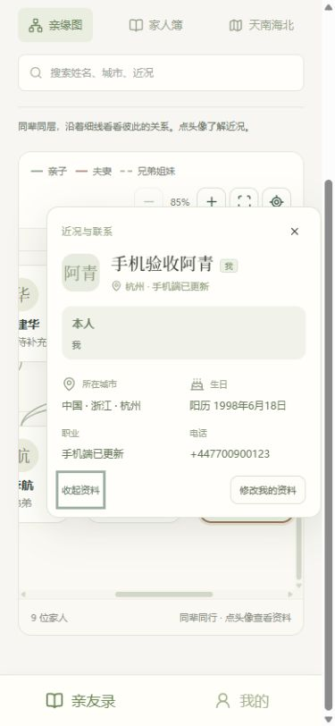


## 手机号对应已有家人资料（2026-10-04）

问题：管理员提前填写的人物资料没有与受邀注册的账号形成连贯流程，容易再建一份人物，注册者也无法编辑原档案。

### 本轮修改

- 管理员添加家人时，手机号移到主表单并必填。前后端统一归一化国内及带国家码的号码；同家庭重复号码拒绝，成功请求重试不误报重复。未绑定人物编辑时也要求补充有效号码，已有历史资料保留。
- 匹配严格使用认证表中的登录手机号，限定邀请所指家庭。受邀者确认“这是我，使用这份资料”，可直接带入已填写的姓名、城市、生日等资料，再提交加入申请。
- 唯一匹配时管理员审核默认沿用原人物，禁止另建重复人物。批准保留人物 ID、亲属关系及可继承照片，普通成员从“我的”维护本人资料。
- 号码尚未短信验证，匹配本身不授予成员或原照片访问权限，仍需管理员核对。多重匹配、他人已绑定、邀请撤销和历史验证门禁明确拒绝；不能通过修改个人联系电话、伪造前端账号 ID 或直接调用自建人物来接管资料。
- 复核修复待审批期间资料变化的恢复流程：本人可重新打开原邀请确认，未由本人修改的系统预填字段随更正同步；本人编辑、明确清空以及完整城市选择保留。原手机号更正后无法匹配时明确提示重新核对邀请，避免一直显示等待。

### 验证结果

- `npm run test:web` **144/144 通过**（HTTP／SQLite 61、网页逻辑 83），较上一轮新增 17 项。手机号相关新增 10 项 HTTP 回归涵盖批准后本人编辑、关系照片保留、越权、资料版本变化、同号冲突、邀请撤销、幂等与并发审批。
- 通用后端回归 **123/123 通过**；`npm run build:web`（含类型检查）和独立生产 API 产物检查通过。已有本地地图按需加载数据块的大文件提示仍存在，本轮未改地图资源。
- 实际浏览器使用隔离的 5174／3002 临时服务：管理员先录入“验收小晴”、手机号和母女关系；同手机号通过邀请注册，确认带入资料、申请、管理员批准、本人修改职业与近况，完整流程成功。
- 浏览器显示仍为 **8 人**，本人高亮为“我”，母亲显示“妈妈”；只读数据库断言确认原人物 ID 不变、原关系仍在、角色为普通成员，职业与近况为本人刚保存的新值。普通成员的“我的”没有管理模块。此次浏览器测试没有上传新照片，照片继承由 HTTP 集成测试覆盖。
- 浏览器新增运行时错误为 0。所有注册、审批、资料修改均在虚构临时数据库中完成，未改用户当前家庭人物资料。

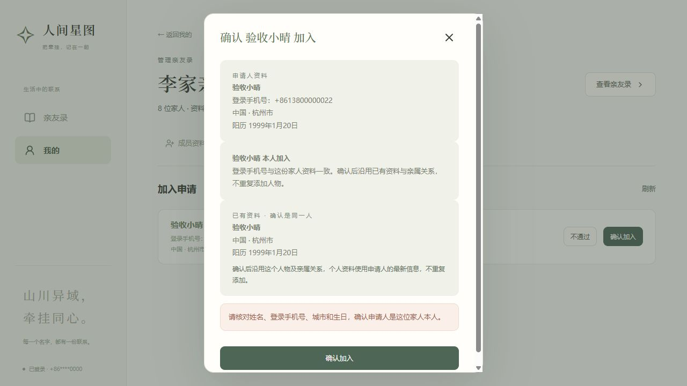

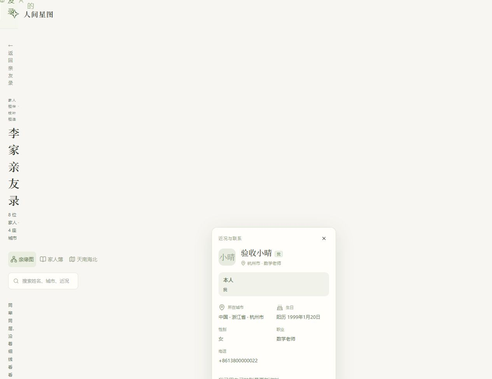

## 城市地图层级与游客生日（2026-10-04）

复现：旧地图只有国家轮廓和家人所在城市标记，放大也看不到基础城市地名；游客页没有接入成员首页已有的生日提醒。

### 本轮修改

- 地图保留默认中国，加入中国省域轮廓、34 个省级名称及现有目录的 3,339 个城市标签。省名和城市名按缩放、视野及文字碰撞取舍，基础地名会避让家人标记。缩放上限由 6 提至 9；选城市时使用适合视口的城市范围。
- 省域细节与原世界轮廓按缩放替换，避免叠画两套海岸线；成员卡放在地图下方，保留城市及人数目录和世界视图。地图仍随网站本地部署，不新增在线瓦片依赖。
- 地图的范围是省界和城市地名，不是市辖区边界、道路或住址定位。目录保留历史名称和粗略城市坐标，未声称核对全国最新全部行政市；来源及固定哈希见 [地图数据说明](web-basemap-data.md)。
- 游客快照加入未来 30 天生日，使用和人物卡一致的有效资料，按日期排序且不排除任何家人。显示今天／明天／天数，农历生日同时显示本次公历日期。顶部采用紧凑卡片，点击后打开对应只读人物详情。
- 按服务器北京时间处理跨日刷新和游客到期；兼容缺少新字段的旧接口响应，换算失败只影响相应生日，不中断家人资料读取。关闭详情、切视图及刷新资料不会再次打开先前生日卡片。

### 验证范围

- 最终 `npm run test:web` **127 项通过，0 失败**（HTTP／SQLite 51、网页逻辑 76），比上一轮新增 21 项。覆盖标签缩放／碰撞／邻城、真实 Leaflet Canvas 卸载、公农历生日边界、游客只读权限、北京时间跨日、旧响应、设备时间偏差及人物选择状态。
- `npm run build:web`（含类型检查）通过；编译后运行 `node scripts/check-web-deploy.mjs` 通过，确认独立生产 API 产物可返回生日快照及刷新时间，游客写接口仍拒绝。
- 两份地图生成器离线重建与哈希校验通过。新增运行数据 gzip 约 373 KB；最终按需加载的 PersonMap 数据块 gzip 约 1.066 MB，因此仍出现 Vite 大文件提示，数据不进入登录主包。许可文本随生产资产输出。
- 实际浏览器确认游客 7 人、4 座城市：李悦 10 月 7 日（3 天后）、王芳 10 月 12 日（8 天后）、张秀英农历九月初九对应 10 月 18 日（14 天后）。点击农历生日打开张秀英只读资料，关闭、切地图／家人簿、刷新后没有重复弹窗。
- 桌面选杭州能看到苏州、宁波、嘉兴、湖州、绍兴等基础地名；中国默认概览有省名，世界视图仍含全部 7 人。手机布局选杭州显示周边城市，最大缩放后按钮禁用，伦敦可展开成员。最终验收实际 CSS 视口为 **390×844**，无横向溢出；这是桌面浏览器视口模拟，不是真机测试。
- 最终服务重启后完整走过生日详情、中国／世界／城市缩放、地图卸载、名单刷新流程，新增控制台错误为 0。本地 5173／3001 服务保持运行，本轮没有修改家庭人物资料。

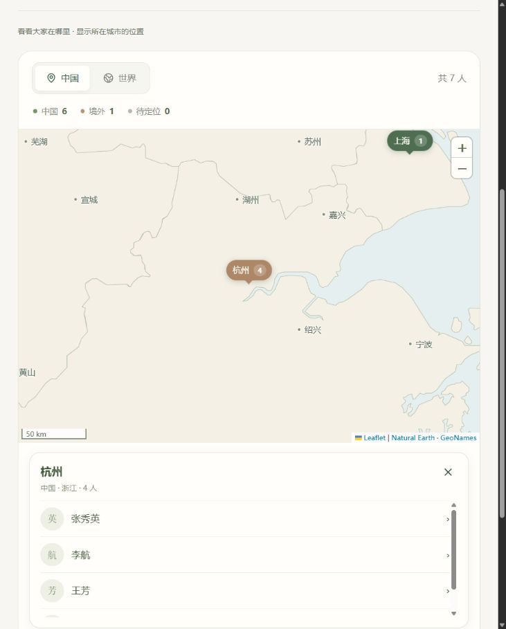

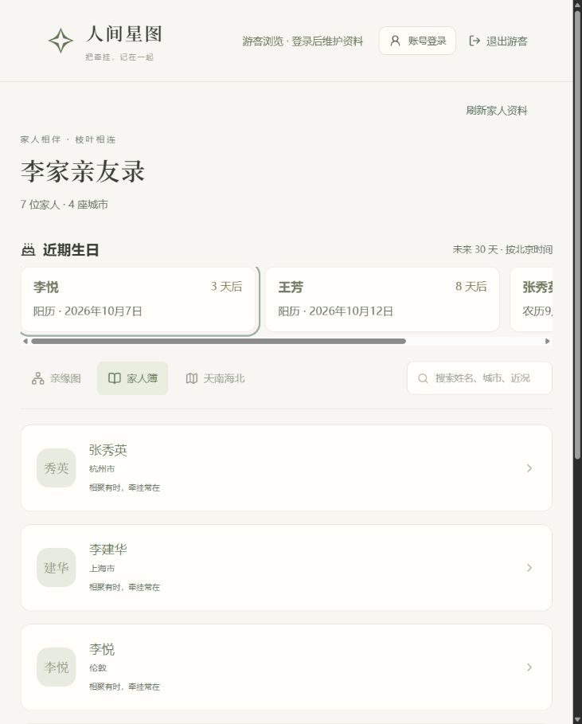

## 登录资格及角色复核（2026-10-04）

复现：旧无邀请账号虽然不能看到任何家庭，但仍能用正确密码登录空首页。根因是注册限制与登录资格没有统一，登录只检查密码和账号存在。

### 修复后的规则

- 未登录与游客：游客仍按家庭名称独立只读浏览全部正常家人资料，不获得账号资格。
- 无邀请历史账号：正确密码也返回 HTTP 403 `ACCOUNT_NOT_INVITED`，不签发会话；已有无资格会话被实际撤销。
- 有效受邀账号：可完善自己的资料、提交申请，首页显示继续加入或等待确认。邀请码过期、撤销、申请被拒后不能继续凭该邀请登录。
- 普通成员：可浏览家庭、维护本人资料与自己的备注；不能使用管理页面或调用管理接口。
- 管理员与首次初始化管理员：保留管理权限；首位管理员未填写本人资料也能登录完善资料。管理员降为普通成员后，刷新到最新角色时卸载整份管理页面及旧弹窗。
- 移出／退出：如果不再拥有其他家庭或有效新邀请资格，撤销账号会话；此前未使用的旧邀请不能复活被移出的身份。重新获邀后仍需原密码，并清除过去旧会话。

服务端使用当前数据库成员／邀请状态和索引判断，无位图权限缓存。会话入口、业务事务、密码操作及照片读完后均复核；在同一事务中处理撤销，不依赖前端隐藏按钮。查询计划已确认成员查询使用 `document_user` 与家庭主键，邀请使用 `invite_account_account`。

### 验收证据

独立临时 SQLite 与 5174／3002 服务复现旧行为，并验证：无邀请旧账号正确密码被拒且表单显示原因；打开有效邀请可用原账号登录；受邀账号主页显示继续加入；提交申请后立即显示等待确认；管理员批准后点击刷新转为正常 8 人家庭；普通成员有本人资料入口但没有管理模块，直达管理地址显示“此页面仅供管理员使用”；提升为测试管理员后可使用专门管理页面。

继续复现并修复了降权后的触发缺口：旧管理页面发起请求收到 `FORBIDDEN` 后，自动合并并发拒绝并重新读取当前账号与家庭角色；确认普通成员后卸载管理页面，真实仍为管理员时保留原业务错误，不退出账号。实际复验“管理员打开邀请页 → 后台降为普通成员 → 点击旧生成邀请按钮”，后台拒绝且页面变为“此页面仅供管理员使用”，账号仍正常登录。随后移出该测试成员，再访问“我的”会退出登录。

HTTP 回归覆盖资格过期、撤销、被拒、移出、旧申请兼容、旧同窗隔离、初始管理员、并发密码验证期间撤销、业务事务及照片读完时撤销。独立生产 API 产物检查增加无资格旧账号登录拒绝且无会话记录。

最终 `test:web` **106 项通过，0 失败**（HTTP／SQLite 44、网页逻辑 62）；网页类型检查、生产构建与独立 API 部署产物检查均通过。106 项包含已有游客、地图、资料、邀请与会话回归。本轮未重复运行未改动的历史小程序测试。

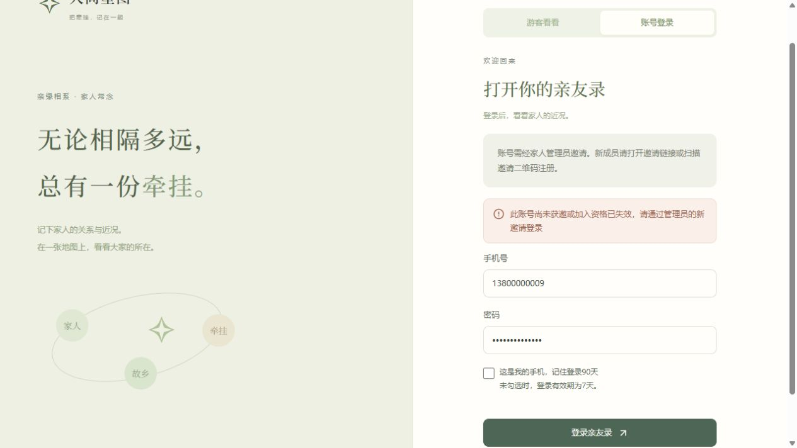

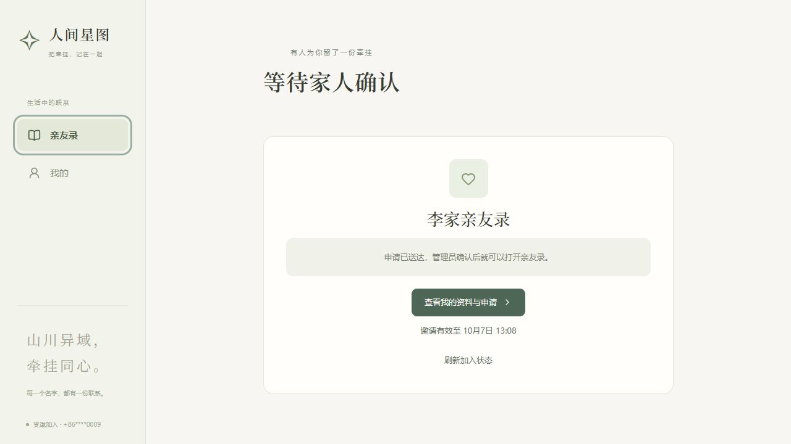

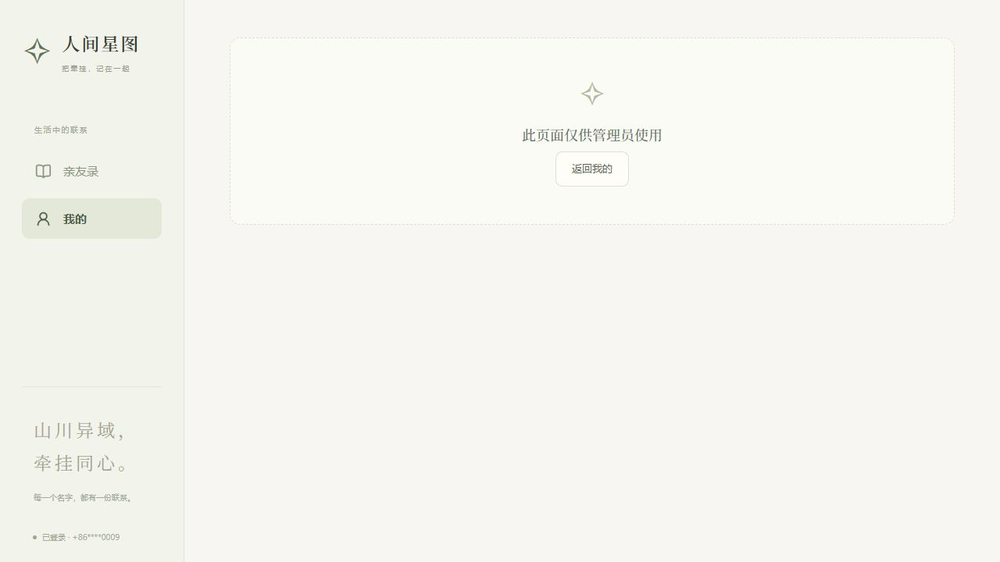

最后确认账号被移出后，家庭名称游客入口仍按既定只读规则工作；验收标签页无运行时错误。5173／3001 本地服务已重启加载新门禁，关闭临时验收服务与页面。所有新增角色变更与申请测试均使用虚构临时资料，用户家庭数据未改动。未进行公网部署或真实手机测试。

## 家庭名称游客入口与角色隔离（2026-10-04）

按用户最新确认，输入完整家庭名称即可查看全部正常家庭资料，包括照片、手机号、微信、完整阳历／农历生日、城市及职业。知道或猜中名称的人均可浏览；家庭名称不是保密凭证。账号注册仍需管理员邀请，编辑与管理仍需账号角色授权。以下历史记录中的“未加入不能查看”仅适用于账号成员接口，不限制新游客入口。

### 实现与修复

- 首页提供“游客看看／账号登录”，游客不创建账号或成员；游客名单、亲缘图与地图共用只读展示。
- 游客使用独立的 4 小时固定会话，仅能访问匹配家庭的资料和照片；不能使用账号 RPC、上传、备注、邀请、设备或管理接口。内部账号标识、申请、审计、权限信息和其他人的私人备注不会提供。
- 所有已填写正常资料与登录成员看到的内容一致，包括本人资料更新、管理员更正、字段清空与照片；移出成员后的新全局资料不再通过原家庭泄漏。
- 图上不假设游客是某位成员；已连接节点显示“家人”，真正孤点显示“关系待补充”，保留同辈分层。
- 游客单个连通分组也按最上层开始显示“第 1 代、第 2 代……”，不会以任意人物作为“上几代”的基准。登录成员的称谓与辈分保持本人视角。
- 实际浏览器发现地图切换到名单后，Leaflet Canvas 遗留绘制帧访问已销毁上下文；改用本地图独立渲染器取消遗留帧并检查绘制生命周期，不修改全局库。使用安装版本的真实 Canvas 代码重现旧错误并回归正常绘制与卸载。
- 登录／注册／退出清理游客状态；邀请链接优先显示邀请流程。修复切换家庭后旧请求的失效响应误清新家庭状态。
- 游客入口限制每 IP 15 分钟 30 次尝试，并限制有效会话容量；同名家庭拒绝歧义匹配，旧同窗与非共享记录不可从游客入口进入。

### 验证结果

全量 `npm test` 首轮 437 项通过；随后新增地图生命周期与游客单分组 4 项回归并重跑 `test:web`，88 项全部通过。当前测试共 **441 项通过，0 失败**：亲属 22、历史关系图 10、业务后端 123、历史小程序 198、Web HTTP／SQLite 38、网页共享逻辑 50。网页类型检查、生产构建、独立生产 API 产物检查均通过。部署检查已增加游客 Secure Cookie、家庭读取与写接口拒绝。

角色与资料变更验收在独立临时 SQLite、5174／3002 服务上完成，未修改用户家庭资料。确认错误名称有提示；正确名称进入；服务重启／页面刷新后游客浏览可恢复；亲缘图、家人簿、默认中国及世界地图人数一致；手机号、微信与完整生日可见，无编辑／备注入口。390×844 CSS 视口没有横向溢出，详情弹窗可读。普通成员切换后有本人资料编辑入口、可保存自己的备注且没有管理模块；退出再进入游客不展示私备注。已有游客状态打开邀请仍显示邀请登录；直达管理地址要求账号登录；退出游客后刷新不恢复浏览。

最终重启 5173／3001 本地服务，原家庭仍为 7 人。只读验证游客图显示第 1／2／3 代，复走世界地图 → 刷新资料 → 家人簿的原报错路径，当前标签页控制台无错误。保留本地预览，关闭独立验收进程。

HTTP 集成另覆盖：两类令牌互换与混合 Cookie 不提权、跨家庭及未绑定照片拒绝、资料融合／清空、固定到期、重启保持、失败尝试限速、会话容量、撤销期间的图片读取。

未进行公网部署及真实手机／微信内置浏览器测试；手机尺寸验收不等同于真机验收。


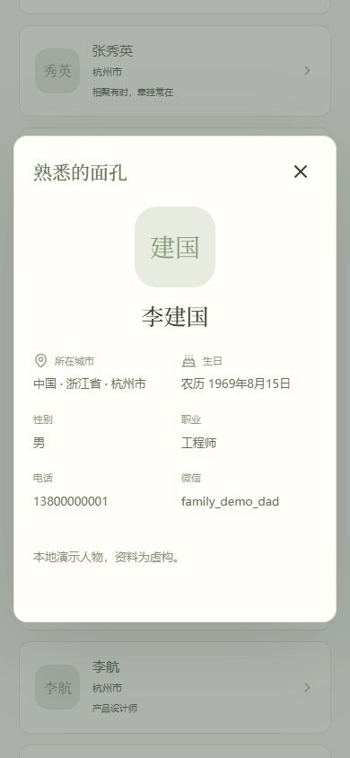

## 私人家庭邀请制与记住登录（2026-10-04）

当前网站只服务自己家庭，关闭自助创建及公开注册。亲戚通过管理员的有效邀请注册，填写资料、申请并经管理员批准后进入。已有账号和资料保留；第一次部署通过本地 `setup:family` 命令初始化管理员与家庭，网页不开放可被陌生人抢先使用的初始化入口。

### 修复与设计

- 全部新建亲友录入口与组件删除，所有 Web 账号调用 `circle.create` 都被后端拒绝。
- 邀请注册在同一事务里创建账号并占用邀请；注册前后复核有效期、撤销和占用状态。已被占用的邀请不再展示注册，原账号仍可登录继续申请；注册本身不授予家庭访问权。
- 普通登录固定 7 天；显式选择记住登录后固定 90 天。原有会话迁移不延长到期时间。会话保留 HttpOnly Cookie 与服务端哈希方式。
- “我的”增加设备列表、单设备退出、退出其他设备。仅提供随机设备 ID、浏览器摘要及时间，不暴露令牌或哈希。
- 管理权变更、移出成员、删除无关系资料等操作要求最近 10 分钟验证过密码；刚登录不重复验证。输入错误或取消不会继续原操作；确认后仅重试原操作一次。
- 业务事务与照片读取完成时再次检查会话，修复先读取身份、随后被撤销仍继续操作的时序风险。前端同时处理 HTTP 401 与业务错误中的登录失效。
- 首次管理员完善资料后自动补建本人节点，只作用于已经加入家庭的有效成员；重复保存与并发不会重复建人。待审批账号不会因此获得访问权。
- 修复人物编辑与密码确认叠加时的键盘焦点：仅最上层处理 Tab／Escape，关闭后恢复原按钮。

### 验证结果

`npm run test:legacy` 与 `npm run test:web` 合计 **419 项通过，0 失败**：亲属 22、历史关系图 10、后端业务 123、历史小程序 198、Web HTTP／SQLite 31、网页共享逻辑 35。网页类型检查、生产构建与独立生产 API 产物检查通过。部署检查覆盖本地初始化、拒绝无邀请注册、拒绝另建家庭以及 90 天 Secure Cookie。

HTTP 新增证据包括：同邀请码并发仅注册一个账号；注册账号与申请／审批对应；密码运算期间撤销邀请不产生账号；旧同窗邀请不能注册；会话固定到期、跨设备撤销隔离、撤销后继续写入及读取照片被拒绝；旧 7 天会话迁移；初始化只能执行一次；本人节点补建及并发去重。

实际浏览器使用独立临时 SQLite 和 5174／3002 测试服务，没有向用户现有家庭加入验收成员。已验证：

1. 公共首页只有登录及管理员邀请说明，没有注册／新建按钮；手机 390×844 CSS 视口无横向溢出。
2. 有效邀请 → 注册 → 原邀请内填写逐级城市及农历生日 → 申请；未审批前直接家庭地址显示无权访问。
3. 同一个邀请注册后，退出再打开不再提供注册；管理员批准、选择稍后补关系后人数由 7 增为 8。
4. 旧会话设置管理员弹出密码确认；错误密码保留登录且不变更角色，取消保持原角色，正确密码继续操作成功，并可恢复普通成员。
5. 删除独立无关系测试资料触发双层弹窗；Tab 可进入上层密码框，取消后回到下层“删除资料”，资料保留。
6. 勾选记住登录后显示 90 天到期；通过 UI 退出其他设备后，第二会话访问返回 HTTP 401，本机保留；退出本机回到登录页。

交互终端 `node server/setup.cjs` 也已在单独空库运行成功：逐项输入手机号、家人录名称、密码及确认，密码不回显。

此轮未进行公网部署、真实手机／微信内置浏览器或容器运行测试。浏览器尺寸与模拟第二设备的 User-Agent 不等同于真实手机测试。

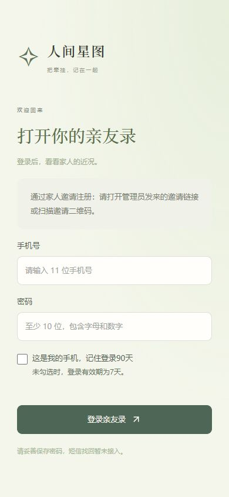

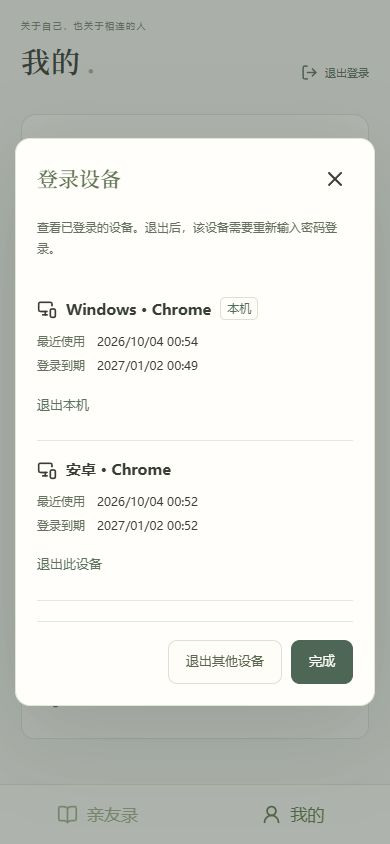

下面保留历史验收；早期关于公开注册或新建入口的描述已由本节取代。

## 家庭专用与视图切换修复（2026-10-04）

本次按用户要求将网页收窄为家庭专用，同时修复亲缘图切到家人簿后误弹人物详情。

- 根因：之前视图共享人物选中状态，切到家人簿只更新页面类型，于是已选人物的浮卡自动变成大弹窗；浮卡内部的折叠状态也被沿用。
- 修复：切换亲缘图、家人簿、天南海北时同时清除人物与定位锚点；详情按视图重新初始化。关闭、重复点同一人、搜索时也清理选择。生日链接每次明确导航可打开人物，切换后不会因普通数据刷新重新弹出。
- 家庭专用：删除同窗入口、创建选项、邀请和管理文案；首页、管理、生日与申请只包含家庭。Web API 从数据访问层限制非家庭记录，包括旧记录 ID、邀请码、照片和间接人物 ID。旧版本同窗数据保留在存储中，当前产品不再提供访问；演示初始化只创建 7 人家庭。
- 查询范围：在 SQLite 查询数量上限和业务分页之前排除旧同窗记录，5005 条旧申请不会挡住家庭申请。

### 浏览器验收

在常用本地虚构演示库上复现旧问题后，已验证：

1. 亲缘图点爸爸 → 切家人簿：无人物弹窗、无残留浮卡。
2. 点击家人簿中的爸爸：正常显示完整城市、农历生日、职业和备注入口。
3. 关闭后反复切换亲缘图／家人簿：不自动打开详情。
4. 首页点生日链接 → 切家人簿：不把生日浮卡变成弹窗。
5. 首页只显示 1 份 7 人家庭，近期生日只含家人；“新建亲友录”只有名称，无同窗类型选择。
6. 直接打开原同窗网址：显示“记录不存在”，无法读取旧同学资料。

`npm test` **403 项通过，0 失败**：亲属称呼 22、历史关系图 10、后端业务 123、历史小程序 198、Web HTTP／SQLite 21、网页共享逻辑与表单 29。新增 6 项视图选择回归及 2 项家庭范围 HTTP 集成测试。网页类型检查、生产构建、独立 API 部署检查通过；前后端已重启。

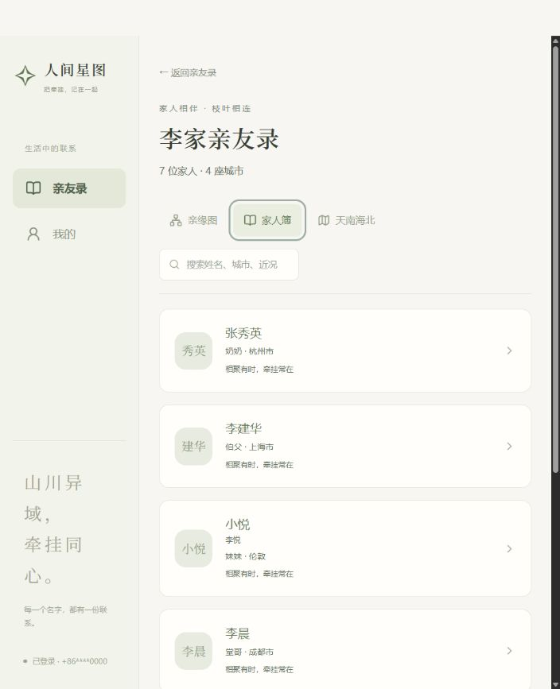

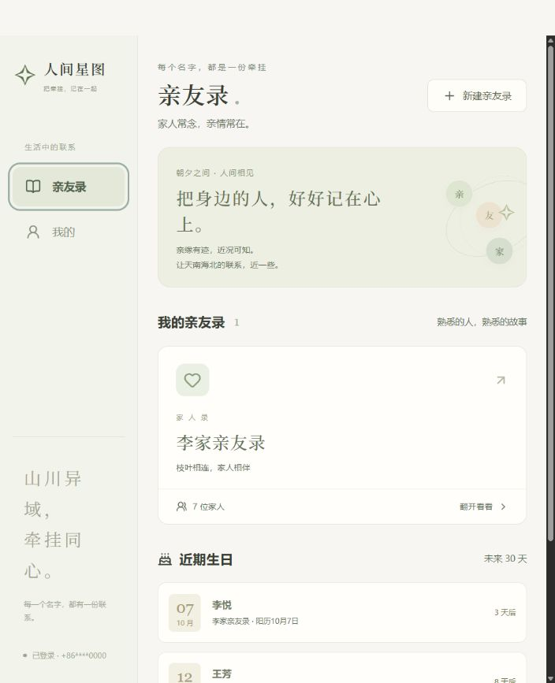

以下保留前几轮验收记录，涉及同窗的描述和测试数量为当时状态；当前产品范围以上述家庭专用版本为准。

## 后续角色与可用性复核（2026-10-03）

本轮额外创建独立临时 SQLite 数据目录，使用 `127.0.0.1:5174` 前端与 `127.0.0.1:3002` API 做实际浏览器测试，未向常用演示数据添加验收人物。

### 本轮修复

- 加载／网络：区分正在加载、空内容与请求失败；生日失败可重试；照片、申请及管理通知的附加请求失败不再让整份个人资料无法显示。
- 邀请／审批：未登录的邀请页说明登录后的下一步；获批者重新打开已使用的邀请仍可进入；管理员关联已有资料时可对照双方姓名、城市、生日；刷新状态失败有反馈。
- 关系图：新加入者尚未连接关系时，既有家人的内部辈分保持分层；不同家人分组不伪造与本人共同辈分，补上关系后自动合并。
- 地图／城市：相邻标记聚合并可展开城市及成员；支持 Enter／空格选择；中国行政区全称与简称在目录唯一匹配时合并，避免“杭州”和“杭州市”重复计数；不同国家／省的同名城市保持分开。
- 个人资料：短月份和闰年限定有效阳历日期；图片失效有姓名兜底；弹窗键盘焦点不进入背景或隐藏字段。
- 角色信息：成员改名后，管理员移交确认使用当前有效姓名；管理页切换亲友录时清理上一份记录的搜索与目标选择。
- 界面：缩小首页欢迎横幅，让亲友录入口更早出现；加深常读说明文字，保留米白配色。手机 390×844 已实际检查。
- 后续底图：默认改为随网站部署的 Natural Earth 真实矢量概览图，无需地图 Key 或外部瓦片；仅打开“天南海北”时加载，地图模块 gzip 约 692 KB。中国／世界、中文地名、城市聚合与成员浮卡保留。窄屏支持更小的缩放级别，避免裁切世界地图；窄屏入口文字不再换行拆开。
- 后续生日：已填出生年的农历日期必须实际存在，修复不存在的闰月及小月三十可保存的问题；本人修改、管理员新增和修改均校验。无年份年度生日继续支持；1900／2100 年农历表覆盖不完整，保留边界。

### 浏览器实测

管理员生成链接／二维码 → 新加入者登录后返回原邀请 → 填写城市及农历生日 → 提交申请 → 未批准前直接访问资料被拒绝 → 管理员审批新增并选择稍后补关系 → 获批者可进入；另一个未加入的账号重复使用同一邀请被拒绝。

此外实测普通成员上传测试照片并成功从独立 API 加载、查看他人只有备注入口、新成员原有家庭辈分保留、管理员事后补关系后并入对应层级。审批已有资料的对照面板已查看；实际关联与保留原关系由 HTTP 集成测试验证。地图聚合的鼠标、Enter、空格、城市选择、成员浮卡均完成实际操作。

新底图另行实测中国／世界切换、伦敦标记用 Enter 打开成员、备注名称与亲属称呼、人物浮卡无背景模糊，以及缩窄视口后的世界全图。默认地图使用本地 canvas，无外部瓦片图片。农历表单实测 2023 年闰二月仅有 29 天，错误的闰三月保存时显示更正提示，取消后未改动演示资料。窄屏浏览器测试的实际 CSS 宽度为 288 像素；未将其表述为真实手机测试。

### 最新验证结果与边界

- `npm test`：**395 项通过，0 失败**。其中亲属称呼 22 项、历史关系图 10 项、后端业务 123 项、历史小程序前端 198 项、新 HTTP／SQLite 19 项、网页共享逻辑及表单 23 项。
- HTTP 新增覆盖创建者、管理员、普通成员之间的角色变更、移交确认、旧会话权限即时撤销、退出隔离及重启后的角色持久化；这些结果不等同于每一步都进行了手工 UI 验收。
- 网页与后端类型检查、生产构建、独立 API 产物检查通过。
- 早期公共瓦片在本机网络下出现过部分加载失败，因此默认方案已替换为本地矢量底图；无需再接生产地图供应商。仍保留可选在线瓦片配置。固定来源 SHA256、几何有效性和逐字节重建已核验，详情见 [地图数据说明](web-basemap-data.md)。
- 手机浏览器尺寸已验证，未在真实手机、微信内置浏览器或生产容器中验收。短信验证、短信找回密码仍待接入。

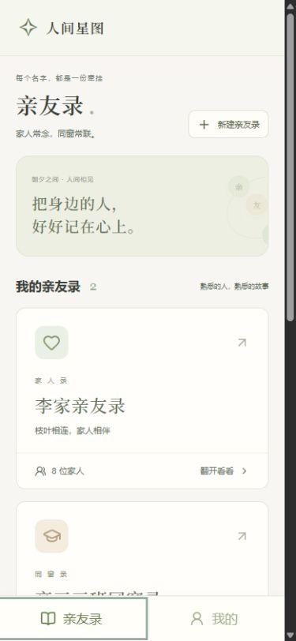

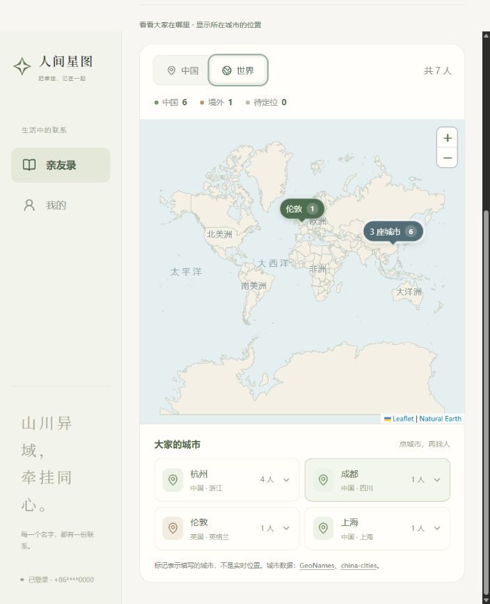

以下为最初迁移时的验收记录，测试数量保留当时结果。

## 已实现的迁移

- React + TypeScript + Vite 网页通过 HTTP API 使用真实持久化数据，刷新或重启后仍可读取。
- Node.js 后端复用既有权限、邀请、人物、关系、备注和生日业务；SQLite 保存资料、账户、会话和限流记录，照片保存在私有目录。
- 手机号加密码登录。未接短信验证，不按用户自行填写的号码自动接管已有资料。管理员可按既有规则人工审核关联；已设置核对号码的记录仍要求号码验证。
- 前后端有独立构建产物、Dockerfile、Compose、反向代理配置和备份说明。小程序历史代码保留。

## 自动化验证

`npm test` 全量通过，共 372 项，0 失败：

- 亲属称呼：22 项。
- 关系图布局：10 项。
- 既有后端业务：120 项。
- 既有小程序前端回归：198 项（这是历史客户端回归，不是 198 项网页端到端测试）。
- 新增 HTTP／SQLite：17 项；网页城市数据与地图聚合：5 项。

同时通过网页与旧客户端类型检查、云函数包一致性检查、项目结构检查。`npm run build` 成功生成前后端产物；`npm run check:deploy` 将 API 文件复制到独立临时目录，在生产配置下验证健康接口、SQLite、注册与 Secure Cookie，未依赖原项目运行目录。

HTTP 测试覆盖：账户与会话、密码散列和更改、旧会话失效、会话过期、身份伪造、来源限制、请求大小、持久化限流、代理 IP 边界、重启持久化、事务回滚与并发修改、邀请审批、现有人物人工关联、未验证号码拒绝关联、普通成员权限、移除后资料／照片访问撤销、照片元数据清理、演示种子与生产环境隔离。

## 实际浏览器验收

- 管理员与普通成员分别通过手机号加密码登录、退出；重启后端后保留数据。
- 首页家人 7 人／同学 4 人，与名册和地图一致；生日列表排除本人，并显示农历生日换算后的日期。
- 家人亲缘图按辈分排列，高亮本人；鼠标点击人物打开浮卡，再次点击同一人关闭。浮卡避开选中的人物，无背景模糊遮罩。
- 地图默认中国，统计中国 6 人、境外 1 人、待定位 0 人；切换世界后显示伦敦。实际外部地图瓦片已加载，按城市展开后可选择人物。
- 保存个人备注“小悦”后，地图人物和名册使用备注，原名“李悦”仍可搜索。
- 管理表单支持国家／省／城市联动、阳历／农历、照片入口、必填生日与城市，以及“稍后补充关系”。本轮通过界面为演示人物补录父母关系，关系列表由 7 条更新到 9 条。
- 普通成员没有管理模块；手动访问管理地址显示“此页面仅供管理员使用”。浏览别人资料时只有个人备注入口；修改自己的资料从“我的”进入。
- 手机 390×844 视口下验收底部导航、“找到我”和浮卡避让；测试后已恢复浏览器原始尺寸。

本轮修复包括：浮卡遮挡选中节点、拖动与点击冲突、过小的图内字号、普通成员无意义的管理占位、事务与认证写入隔离、反向代理下 IP 限流、Docker 构建排除本地数据库／照片、部署示例来源地址不一致。

## 验证边界

- 未安装 Docker，本轮没有执行真实镜像构建、容器启动、域名解析和 HTTPS 证书签发；已完成配置检查与独立 API 产物运行验证。
- 未接短信发送、手机号真实性验证、短信找回密码；这是本次选定的登录方案边界。
- 外部地图依赖网络及地图服务授权，尚未验证生产流量、各地区网络及生产地图供应商。
- 浏览器做了上述关键流程抽查；更完整的邀请、权限和并发异常路径通过自动化集成测试验证，不把它们表述为全部逐项手动验收。
- 当前数据库部署为单个 API 实例，未验证多实例、负载测试或真实手机微信内置浏览器。

## 复验入口

```powershell
npm test
npm run build
npm run check:deploy
npm run dev
```

本地页面：<http://localhost:5173>。演示账号和启动说明见 [README](../README.md)；部署见 [web-deployment.md](web-deployment.md)。

手机浮卡实测截图：

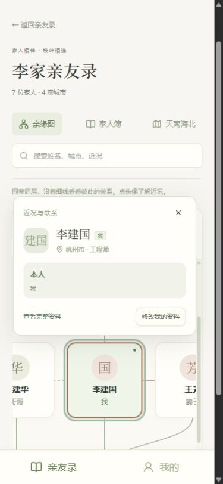
